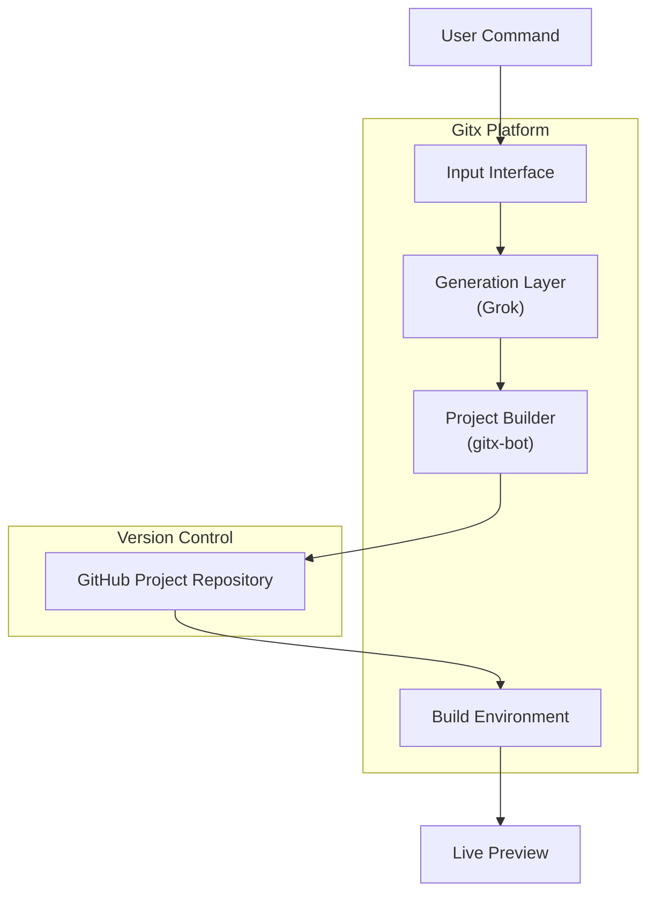

# Gitx Architecture

This document describes the high-level architecture of the Gitx platform.

Gitx is designed as a system that converts user intent into generated software projects using standard version control workflows and isolated build environments.

---

## System Overview

---

## Component Responsibilities

### 1. Input Interface

The input interface is responsible for receiving user project requests.

Supported inputs include:
- Commands submitted via X (Twitter)
- Future web-based interfaces
- Future API-based access

This layer only handles intent intake and does not generate code or manage repositories.

---

### 2. Generation Layer (Grok)

The generation layer interprets user intent and generates project artifacts.

Responsibilities:
- Generate project structure
- Generate source code
- Generate documentation
- Generate build configuration

This layer produces files only and does not create repositories or trigger builds.

---

### 3. Project Builder (gitx-bot)

The project builder is implemented as a system account.

Responsibilities:
- Create a new GitHub repository for each generated project
- Commit generated files
- Push the repository to the Gitx Lab organization
- Apply naming, visibility, and ownership conventions

Each user request always results in a separate repository.

---

### 4. Version Control Layer (GitHub)

GitHub acts as the source of truth for all generated projects.

Responsibilities:
- Store generated repositories
- Preserve commit history
- Enable cloning and forking
- Provide transparency and auditability

The core platform repository and generated project repositories are strictly separated.

---

### 5. Build and Preview Layer

The build layer prepares generated projects for preview purposes.

Responsibilities:
- Clone generated repositories
- Build projects in isolated environments
- Produce runnable previews
- Apply resource and time limits

Build environments are temporary and do not persist state.

---

## Ownership Model

- The core platform repository is created and maintained by a human owner.
- Generated project repositories are created and maintained by the system builder account.
- Users interact with the system through commands rather than direct repository access.

---

## Design Principles

Gitx is built around the following principles:
- Intent-driven project generation
- Repository-first workflows
- Clear separation of responsibilities
- Predictable and inspectable output
